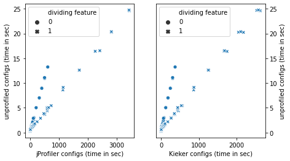
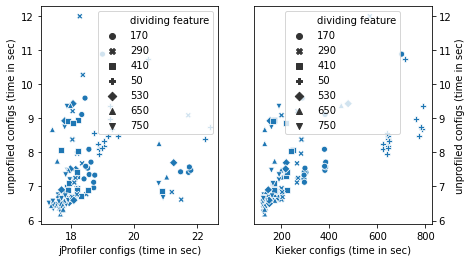
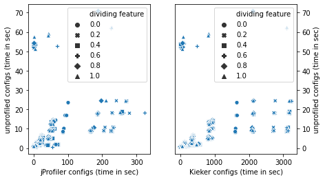
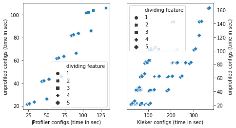
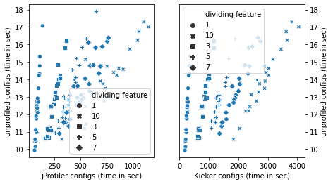

## Subject Systems

On this page we list the subject systems that we use to evaluate our approach. Each folder contains a submodule to the subject system's source repository and the feature model we used for sampling the configurations.

### Profiled vs. Unprofiled
We identified different patter for the influence of the profiler on the subject systems.

#### Catena

#### CPD

#### Density-Converter

#### Prevayler

#### Sunflow

